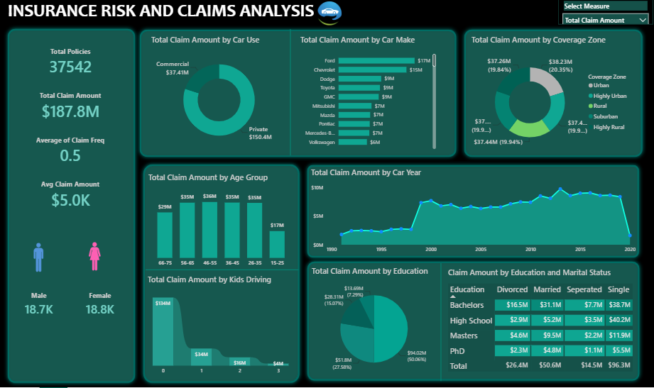

# 🛡️ Insurance Risk & Claims Analysis Dashboard

## 📌 Project Overview

This Power BI dashboard provides a comprehensive analysis of insurance policies, claims, customer demographics, and risk factors. The objective is to help insurance companies monitor claim patterns, identify high-risk customer segments, evaluate policy performance, and support data-driven decision-making.

---

## 🎯 Business Problem

Insurance companies handle large volumes of policy and claims data. Without proper analysis, it becomes difficult to:

- Monitor claim trends over time
- Identify high-risk customer segments
- Analyze claim amounts across demographics
- Understand vehicle usage impact on claims
- Evaluate coverage zone performance
- Support risk assessment and business decisions

This dashboard transforms raw insurance data into actionable insights through interactive visualizations and KPI tracking.

---

## 📊 Key KPIs

| KPI | Value |
|------|------|
| Total Policies | 10,302 |
| Total Claim Amount | 188M |
| Average Claim Frequency | 0.14 |
| Average Claim Amount | 18.24K |

---

## 📈 Dashboard Features

### Executive KPI Overview
- Total Policies
- Total Claim Amount
- Average Claim Frequency
- Average Claim Amount

### Customer Risk Analysis
- Claim Amount by Age Group
- Claim Amount by Gender
- Claim Amount by Education Level
- Claim Amount by Marital Status

### Policy & Coverage Analysis
- Claim Amount by Coverage Zone
- Claim Amount by Car Usage Type
- Claim Amount by Kids Driving

### Trend Analysis
- Year-wise Claim Amount Trend
- Historical Claims Performance

### Interactive Features
- Dynamic Measure Selection
- Interactive Filtering
- Drill-down Analysis
- Responsive Visualizations

---

## 🔍 Key Insights

### 1. Vehicle Usage Impact
- Private vehicle users contribute approximately **80% of total claim amounts**, making them the largest claim-generating segment.

### 2. Age-Based Claim Trends
- Customers between **26 and 65 years** account for the highest share of claim amounts.
- Senior age groups generate comparatively lower claim values.

### 3. Gender Distribution
- Claim amounts are distributed relatively evenly across genders, with a slight variation between male and female policyholders.

### 4. Coverage Zone Analysis
- Claim amounts are fairly balanced across coverage zones, indicating a broad distribution of insurance risk.

### 5. Family Driving Behavior
- Customers without kids driving contribute a significant portion of total claims compared to other groups.

### 6. Education & Marital Status
- Customers with a Bachelor's degree and Married customers account for a larger share of claim amounts.

### 7. Claim Trend Over Time
- Claim amounts increased significantly after 2000 and remained relatively stable in subsequent years.

---

## 🛠️ Tools & Technologies

- Power BI
- Power Query
- DAX
- Data Modeling
- Data Visualization
- Interactive Dashboards

---

## 📷 Dashboard Preview

---

## 🚀 Skills Demonstrated

- Data Cleaning & Transformation
- Data Modeling
- DAX Calculations
- KPI Development
- Risk Analysis
- Claims Analysis
- Business Intelligence Reporting
- Dashboard Design
- Interactive Visualization

---

## 📌 Conclusion

The Insurance Risk & Claims Analysis Dashboard provides a comprehensive view of insurance performance by combining claims analysis, customer segmentation, and risk evaluation into a single interactive reporting solution. Through effective use of Power BI, DAX, and data modeling, the dashboard helps uncover trends, identify high-risk areas, and support strategic decision-making. This project highlights the ability to transform complex datasets into clear, actionable insights that drive business value.
